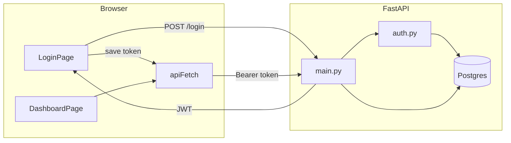

# Library App

A small full-stack app for browsing a catalog of books and saving some of them to **your** library.

This is a learning project, not a product. The code is kept small on purpose so you can read every file and see how a real request travels from the browser, through auth, into Postgres, and back to the UI.

You will get the most out of it if you already know a little Python and a little JavaScript. You do not need to know FastAPI, React, or SQLAlchemy yet.

---

## What you can do in the app

1. Create an account and log in.
2. Browse every book, and search by title.
3. Save a book to **My Library** (safe to click twice — saving is idempotent).
4. Remove a book from your library.
5. Log out. The next visit to `/` sends you back to login.

There is one catalog of books for everyone. Each user has their own saved list.

```text
Browser (React)  →  FastAPI  →  Postgres
     :5173            :8000        :5432
```

---

## What you will learn

These are the ideas this repo is built to teach. Each one maps to real files — do not just memorize the names.

### Backend

| Idea | Why it matters | Where to look |
| --- | --- | --- |
| HTTP API | The frontend never talks to the database. It only calls URLs. | `Backend/main.py` |
| Request / response models | Pydantic decides what JSON is allowed in and out. | `Backend/schemas.py` |
| Tables vs API shapes | A `User` row stores a hashed password. The API never returns it. | `Backend/models.py` vs `schemas.py` |
| SQLAlchemy sessions | Open a connection, use it, close it — even when a request fails. | `Backend/database.py` |
| Password hashing | You store a hash, never the password. | `Backend/auth.py` (`hash_password`, `verify_password`) |
| JWT (access tokens) | After login, the client proves who it is with a Bearer token. | `Backend/auth.py`, `POST /login` |
| Config from `.env` | Secrets and the DB URL stay out of source. Missing values fail at startup. | `Backend/config.py`, `Backend/.env.example` |
| Dependencies | `Depends(get_current_user)` is how FastAPI injects “the logged-in user.” | `GET /me`, `/my-library` |
| Many-to-many | `saved_books` is just `(user_id, book_id)`. That *is* “my library.” | `SavedBook` in `models.py` |
| CORS | A page on `:5173` is a different origin from `:8000`. The API must allow it. | `CORSMiddleware` in `main.py` |
| Seeding | The catalog is not typed in by hand. `books.json` is loaded once. | `Backend/seed.py` |

### Frontend

| Idea | Why it matters | Where to look |
| --- | --- | --- |
| SPA routing | `/` and `/login` are React routes, not separate HTML files. | `Frontend/src/App.tsx` |
| Protected routes | No token in `localStorage` → bounce to `/login`. | `ProtectedRoute.tsx` |
| One fetch helper | Every request goes through `apiFetch`, which attaches the token. | `Frontend/src/api.ts` |
| 401 handling | Bad password ≠ expired session. Only a 401 *with* a token logs you out. | `api.ts` comments |
| Forms + `fetch` | Login sends `application/x-www-form-urlencoded` because OAuth2 password flow expects that. | `LoginPage.tsx` |
| `useState` / `useEffect` | Tab, search, loading, and saved IDs are React state — not extra routes. | `DashboardPage.tsx` |
| Derived state | `savedIds` is a `Set` built from the library list while rendering. | `DashboardPage.tsx` |
| Loading and error UI | The page does not pretend data is always there. | both pages |

### How the pieces fit



---

## Project layout

```text
LibraryApp/
├── docker-compose.yml          # Postgres 16
├── Backend/
│   ├── main.py                 # routes (start here after models)
│   ├── models.py               # database tables
│   ├── schemas.py              # JSON in/out
│   ├── config.py               # reads Backend/.env
│   ├── .env.example            # copy to .env (never commit .env)
│   ├── database.py             # engine + get_db()
│   ├── auth.py                 # hash, JWT, get_current_user
│   ├── seed.py                 # load books.json once
│   └── books.json              # starter catalog
└── Frontend/
    └── src/
        ├── main.tsx            # mounts React
        ├── App.tsx             # routes
        ├── api.ts              # token + fetch
        ├── types.ts            # Book
        ├── components/ProtectedRoute.tsx
        └── pages/
            ├── LoginPage.tsx
            └── DashboardPage.tsx
```

Read **down** this list the first time. Each file only makes sense once the one above it does.

---

## Run it locally

You need **Docker**, **Node.js**, and **Python 3.14+** with [uv](https://docs.astral.sh/uv/).

### 1. Start Postgres

From `LibraryApp/`:

```bash
docker compose up -d
```

This creates database `libraryappdb` with user `admin` / `admin` on port `5432` — the same URL as `Backend/database.py`.

### 2. Start the API

```bash
cd Backend
cp .env.example .env
# Edit .env and set SECRET_KEY to a long random string:
#   python -c "import secrets; print(secrets.token_hex(32))"
uv sync
uv run python seed.py
uv run uvicorn main:app --reload --port 8000
```

Check it: [http://localhost:8000/health](http://localhost:8000/health) should return `{"status":"Online"}`.

Interactive docs (try requests here before you write UI): [http://localhost:8000/docs](http://localhost:8000/docs).

### 3. Start the UI

In a second terminal:

```bash
cd Frontend
npm install
npm run dev
```

Open [http://localhost:5173](http://localhost:5173). The Vite origin **must** be `5173` — CORS only allows that one.

### 4. Create a user

There is no “sign up” screen. Register with curl once, then log in through the UI:

```bash
curl -X POST http://localhost:8000/register \
  -H "Content-Type: application/json" \
  -d '{"username":"demo","password":"demo123"}'
```

Then log in with that username and password.

---

## How a request actually works

Walk this with `/docs` or curl. Do not skip the “why” under each step.

### Register and log in

```bash
curl -X POST http://localhost:8000/login \
  -H "Content-Type: application/x-www-form-urlencoded" \
  -d "username=demo&password=demo123"
```

You get `{ "access_token": "...", "token_type": "bearer" }`.

- The password is checked against `hashed_password` with bcrypt.
- The token is a JWT whose `sub` is the **user id**, not the username.
- It expires in 30 minutes (`ACCESS_TOKEN_EXPIRE_MINUTES`).

Save the token and call a protected route:

```bash
curl http://localhost:8000/me \
  -H "Authorization: Bearer YOUR_TOKEN_HERE"
```

`get_current_user` decodes the JWT, loads that user from Postgres, and FastAPI injects it into the route. If the token is missing or wrong, you get **401**.

### Catalog vs your library

| Method | Path | Auth? | What it does |
| --- | --- | --- | --- |
| `GET` | `/books?search=` | no | list / filter catalog by title |
| `GET` | `/books/{id}` | no | one book |
| `POST` | `/books` | no | add a book to the catalog |
| `POST` | `/register` | no | create a user |
| `POST` | `/login` | no | return a JWT |
| `GET` | `/me` | yes | current user |
| `GET` | `/my-library` | yes | books **you** saved |
| `POST` | `/my-library/{book_id}` | yes | save (201, idempotent) |
| `DELETE` | `/my-library/{book_id}` | yes | unsave (204) |

Notice the split: anyone can read the catalog. Only a logged-in user can touch **their** library. That is the core design of the app.

On the frontend, `DashboardPage` fetches `/books`, `/my-library`, and `/me` together. It builds `savedIds` from the library list, then renders **+ Save** or **Saved ✓** by asking `savedIds.has(book.id)`.

---

## Suggested path through the code

Do these in order. After each step, answer the question out loud or in a note. If you cannot, re-read that file before moving on.

### Day 1 — Use the app as a user

1. Register, log in, search “Dune”, save it, open **My Library**, delete it, log out, hit `/` again.
2. Open DevTools → Network. Log in once more. Find the `login` request. What is the request **content type**? Why is it not JSON?
3. Find the `access_token` in Application → Local Storage. Delete it and refresh. What happens, and which component caused it?

### Day 2 — Backend, inside out

1. `models.py` — Draw the three tables on paper. Why does `SavedBook` have **two** primary key columns?
2. `schemas.py` — Why is there a `UserCreate` and a `UserRead`? What would go wrong if you returned `User` the model from `/me`?
3. `config.py` — What happens if you start the API with no `.env` and no `SECRET_KEY` in the environment?
4. `database.py` — What does `yield` do inside `get_db`? When does `db.close()` run?
5. `auth.py` — Trace `get_current_user` with a valid token, then an expired one. Which exception becomes HTTP 401?
6. `main.py` — For `POST /my-library/{book_id}`, list every check before `session.commit()`.
7. Bonus: add `?search=` in `/docs` and watch the SQL idea: `title ILIKE '%dune%'`.

### Day 3 — Frontend, request by request

1. `types.ts` → `api.ts` — Why does `apiFetch` **not** redirect on login 401?
2. `ProtectedRoute` — This only checks `localStorage`. It does **not** ask `/me`. What is the tradeoff?
3. `LoginPage` — After a successful login, where does the token go, and who reads it next?
4. `DashboardPage` — Why is the tab in `useState` instead of a `/library` route?
5. Save a book. Watch Network. Confirm `POST /my-library/1` then notice the UI updates **without** refetching the whole catalog. How?

### Day 4 — Break it on purpose

These are safe, local experiments. Change one thing, run it, then undo.

- Comment out `CORSMiddleware` and reload the UI. Read the browser error.
- Return the password hash from `/me`. See why `UserRead` exists.
- In `api.ts`, redirect on **every** 401, including login. Try a wrong password.
- Save the same book twice. Confirm the API still returns 201 and does not insert a duplicate row.

---

## Data model

```text
users              books
─────              ─────
id                 id
username           title
hashed_password    author
                   description

saved_books
───────────
user_id  → users.id
book_id  → books.id
```

`saved_books` is a join table. “This user saved this book” is a row. Deleting that row is unsave. The `books` row stays.

---

## Known shortcuts (do not copy these to production)

This project chooses simplicity over production hardening. Know what you are trading away:

- **Token lives in `localStorage`.** Convenient, but any XSS on the page can steal it. Production apps often use `httpOnly` cookies.
- **`GET /books` is public.** Fine for a demo catalog. A private library API would require a token on every book route.
- **No pagination.** The catalog is small. Real lists need `limit` / `offset` (or cursors).
- **No tests.** The next skill to add is a pytest for `save_book` (idempotent + 404) and a frontend test for “no token → `/login`.”

If you are building a portfolio version, fix the cookie/token storage before you treat this as a real auth system.

---

## Ideas if you want to go further

Pick **one**. Finish it. That teaches more than skimming ten.

1. Add a Register page that `POST`s JSON to `/register`, then sends the user to login.
2. Protect `GET /books` with `Depends(get_current_user)` and confirm the UI still works.
3. Show `description` on each card, or on a `/books/:id` page.
4. Paginate `/books` (`skip` + `limit` query params).
5. Write one backend test: saving a missing `book_id` returns 404.

---

## Troubleshooting

| Symptom | Likely cause |
| --- | --- |
| UI loads, login fails with a network / CORS error | API is down, or the UI is not on `http://localhost:5173` |
| API crashes on start mentioning `secret_key` | You have no `Backend/.env` — `cp .env.example .env` and set `SECRET_KEY` |
| `connection refused` from FastAPI | Postgres is not running — `docker compose up -d` |
| Empty book list | `seed.py` was never run, or it ran before Postgres was up |
| Logged in, then suddenly back at login | Token expired (30 minutes) or a 401 cleared `localStorage` |
| `Username already exists` | That name is taken — pick another, or log in |

---

## License / intent

Written to be read. Clone it, break it, rewrite a file from memory, then compare. That is the point.
